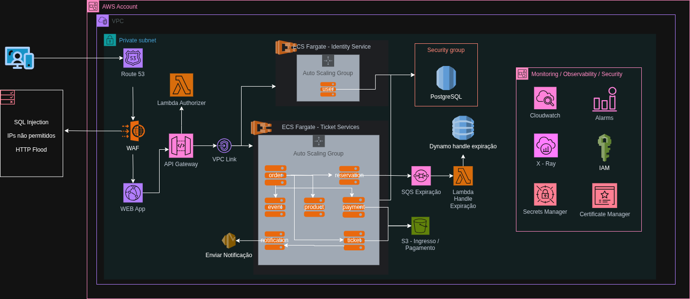

 🎟️ Sistema de Bilhetagem - Itaú Case

Este projeto consiste em um sistema de bilhetagem distribuído, baseado em **microserviços** e **arquitetura hexagonal**, com foco em princípios de segurança (OWASP), boas práticas de design (Clean Architecture, SOLID, 12 Factors), e integração entre serviços.

A solução foi desenvolvida como entrega para o **case técnico Itaú - vaga Engenheiro(a) de Software Sênior**.

## 🌟 Arquitetura Geral



A arquitetura foi pensada para garantir:

✅ Separação clara de domínios (DDD)  
✅ Alta disponibilidade (Multi-AZ)  
✅ Desacoplamento entre componentes (SQS)  
✅ Escalabilidade horizontal (ECS Fargate)  
✅ Observabilidade (CloudWatch, X-Ray)  
✅ Segurança (WAF, API Gateway, Cognito, IAM, Secrets Manager)  
✅ Performance e otimização de custos (uso intensivo de serviços gerenciados)

### Principais componentes:

- **AWS WAF** → proteção contra ataques comuns
- **API Gateway** → gestão de APIs REST
- **Amazon Cognito** → autenticação OAuth2 + JWT
- **ECS Fargate** → execução de containers em subnets privadas
- **RDS PostgreSQL (Multi-AZ)** → banco relacional transacional
- **Amazon SQS** → mensageria para orquestração entre serviços
- **Amazon S3** → armazenamento de ingressos em PDF
- **CloudWatch + X-Ray + IAM + Secrets Manager** → observabilidade e segurança

### Topologia de rede:

- Subnets públicas: WAF, API Gateway, Cognito
- Subnets privadas: ECS tasks e RDS
- Múltiplas zonas de disponibilidade (AZs)

## 🌟 Arquitetura de Software

A arquitetura escolhida foi **microserviços com arquitetura hexagonal** para cada serviço, com os seguintes motivos:

✅ Separação clara de domínios de negócio (DDD)
✅ Evolução e manutenção desacoplada
✅ Testes unitários e de integração mais fáceis
✅ Melhor suporte a escalabilidade
✅ Cada serviço com banco próprio (PostgreSQL no compose, SQLite local)

Todos os serviços seguem:

- **Clean Architecture** — domínio isolado da infraestrutura
- **Princípios SOLID** e 12 Factors
- Práticas de segurança OWASP (validação, controle de erros)
- Integração por REST entre serviços
- API OpenAPI (Swagger gerado automaticamente)

**Orquestração:** GitHub Actions (CI/CD) — não incluso na entrega, mas documentado.

**Banco:** PostgreSQL ou SQLite (para testes locais)

**Backend:** Python 3.12 + FastAPI + SQLAlchemy

**PDF:** FPDF (geração de ingressos)

**Outros:** Makefile e scripts utilitários para facilitar o uso.

---

## 🧱 Serviços

- **user-service**: CRUD de usuários
- **event-service**: CRUD de eventos
- **product-service**: Produtos complementares
- **ticket-service**: Controle de ingressos + geração de PDF
- **reservation-service**: Reservas de ingressos, com expiração automática
- **order-service**: Orquestra a finalização de pedidos e confirmação de reservas

---

## 🗺️ Fluxo de Compra

1️⃣ Usuário e evento são cadastrados  
2️⃣ Tickets são cadastrados para o evento  
3️⃣ Reserva de ingressos é feita (temporária, com expiração)  
4️⃣ Produtos complementares podem ser adicionados ao pedido  
5️⃣ Pedido é finalizado:

- Ordem é criada
- Reserva é confirmada
- Pagamento é processado (mock)
- Ticket em PDF é gerado e armazenado em S3

---

## ⚙️ Como rodar o projeto

### Localmente (SQLite, sem docker)

[Como rodar o projeto](docs/run-instructions.md)

---

## 🚀 Endpoints (exemplos)

### `user-service`

```http
GET /users/
GET /users/{id}
POST /users/ { name, email }
```

### `event-service`

```http
GET /events/
POST /events/ { title, location, date }
```

### `ticket-service`

```http
POST /tickets/ { event_id, quantity, price }
POST /tickets/from-order { payload do pedido }
GET /tickets/{id}/pdf
```

### `reservation-service`

```http
POST /reservations/ { user_id, ticket_id, quantity }
GET /reservations/user/{user_id}
```

### `order-service`

```http
POST /orders/ { user_id, event_id, items, products, total_price }
GET /orders/
GET /orders/{id}
```

---

## 🛡️ Segurança

✅ Validação de payloads com Pydantic  
✅ SQL Injection safe (SQLAlchemy ORM)  
✅ Sem exposição de dados sensíveis  
✅ Logs protegidos  
✅ Integração entre serviços autenticada por IP local (exemplo)

---

## 🛠️ Tecnologias

- Python 3.12
- FastAPI
- SQLAlchemy
- SQLite / PostgreSQL
- FPDF (geração de PDF de ingressos)
- qrcode
- Makefile + Bash Scripts

---

---

## 📋 Boas práticas adotadas

- **AWS Well-Architected Framework** (segurança, confiabilidade, performance, eficiência de custos, excelência operacional)
- Clean Architecture + SOLID + 12 Factors
-
- Logging e tracing distribuído com CloudWatch e X-Ray
- Orquestração desacoplada com SQS
- Gestão segura de segredos com AWS Secrets Manager
- Uso de múltiplas AZs e serviços gerenciados para alta disponibilidade

---

## 📝 Documentação complementar

- [Decisions.md](docs/decisions.md) — decisões técnicas detalhadas
- Arquitetura visual: `Arquitetura Bilhetagem.drawio` (disponível para edição em diagrams.net)

---