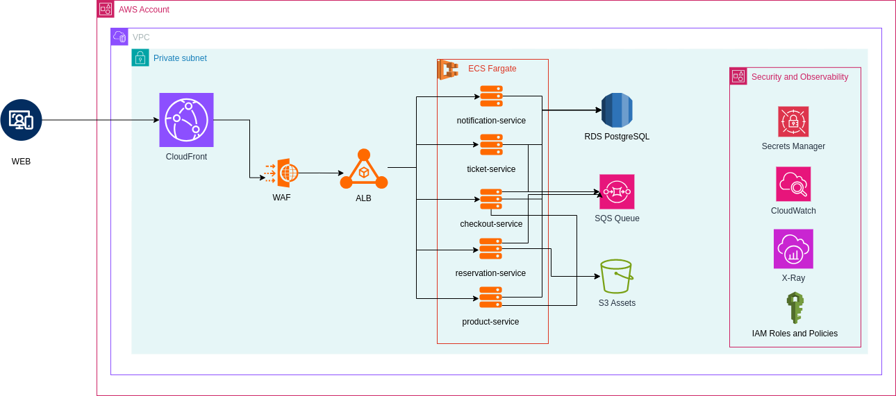

# Arquitetura AWS – Sistema de Bilhetagem

## 🎯 Objetivo

Esta arquitetura foi projetada para atender a um sistema de bilhetagem escalável, seguro e altamente disponível. Adota boas práticas de microsserviços, segurança (OWASP), observabilidade e componentes serverless.

---

## 📐 Componentes da Arquitetura

### 🔒 Camada de Entrada

- **CloudFront**: CDN para entrega global, cache e HTTPS com ACM.
- **AWS WAF**: Proteção contra ameaças OWASP Top 10.
- **Application Load Balancer (ALB)**: Balanceamento de carga entre serviços ECS.

### 🚀 Microsserviços (ECS Fargate)

Executados em **AWS Fargate**, sem necessidade de gerenciamento de infraestrutura.

**Serviços:**

- `ticket-service`: gerenciamento de eventos e ingressos.
- `reservation-service`: reservas temporárias e sua expiração.
- `checkout-service`: processo de compra de ingressos e produtos.
- `product-service`: catálogo de itens adicionais (pipoca, bebidas etc.).
- `notification-service`: envio de e-mails ou mensagens via SQS/SNS.

---

## 📦 Integrações

- **Amazon RDS (PostgreSQL)**: banco relacional para dados consistentes (eventos, usuários, compras).
- **Amazon SQS**: comunicação assíncrona e desacoplamento de processos.
- **Amazon S3**: armazenamento de comprovantes e imagens de ingressos.

---

## 🔐 Segurança e Observabilidade

- **AWS Secrets Manager**: armazenamento seguro de credenciais e segredos de API.
- **Amazon CloudWatch**: logs, métricas e alarmes centralizados.
- **AWS X-Ray**: rastreamento distribuído e identificação de gargalos.
- **IAM Roles and Policies**: controle granular de acesso por serviço (least privilege).

---

## 🧩 Boas práticas aplicadas

| Prática                  | Implementação                                                                |
|--------------------------|-------------------------------------------------------------------------------|
| **OWASP Top 10**         | Proteção com WAF, validação de entradas, segredos seguros via Secrets Manager |
| **Least privilege**      | IAM Roles distintas por serviço                                              |
| **Escalabilidade**       | Fargate com Auto Scaling, SQS com buffer, RDS burstable                      |
| **Alta disponibilidade** | ALB + CloudFront + Multi-AZ                                                  |
| **Observabilidade**      | Logs via CloudWatch, trace com X-Ray                                         |
| **Segurança de dados**   | Sub-redes privadas, HTTPS, Secrets Manager, S3 seguro                        |
| **Modularidade**         | Microsserviços isolados e independentes                                     |

---

## 🧠 Conclusão

Essa arquitetura permite um desenvolvimento desacoplado, com alta resiliência e segurança, preparada para escalar sob demanda. Ideal para sistemas que lidam com transações sensíveis e precisam de rastreabilidade e performance garantida.

